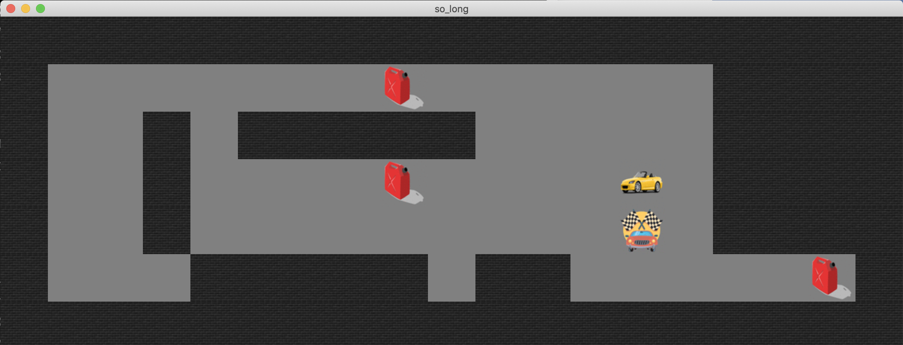

### so_long - First graphical 42 project!
```md

## About

**so_long** is a 42 project that implements a simple 2D game using the `mlx` (MiniLibX) library. The game involves navigating a character through a maze to collect items and reach a goal while avoiding obstacles.

## Features

- **Maze Generation**: Load and display a maze from a map file.
- **Character Movement**: Control the character using keyboard inputs.
- **Item Collection**: Collect items and reach the goal to complete the level.
- **Graphics**: Basic graphics using MiniLibX for rendering.

## Installation

1. **Clone the repository:**
    ```bash
    git clone https://github.com/Onesignature/so_long.git
    cd so_long
    ```

2. **Install MiniLibX**:
   Follow the installation instructions for MiniLibX provided in the [MiniLibX documentation](https://harm-smits.github.io/42docs/libs/minilibx/).

3. **Build the project:**
    ```bash
    make
    ```

## Usage

Run the game with:
```bash
./so_long maps/valid/map.ber
```

Replace `map.ber` with your map file. The map file should use the following characters:
- `1` for walls
- `0` for empty space
- `C` for collectible items
- `E` for the exit
- `P` for the player’s starting position

## Example

```bash
$ ./so_long map.ber
```
## Maps


## How It Works

1. **Map Loading**: Parses the map file to create the game world.
2. **Rendering**: Uses MiniLibX to draw the maze and game elements.
3. **Controls**: Moves the character based on keyboard input and updates the game state.
4. **Completion**: Checks for item collection and goal achievement to determine game completion.
```
